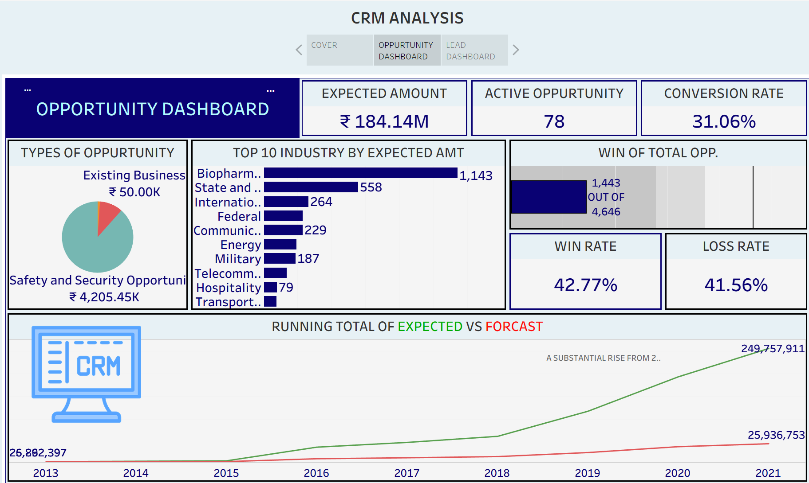
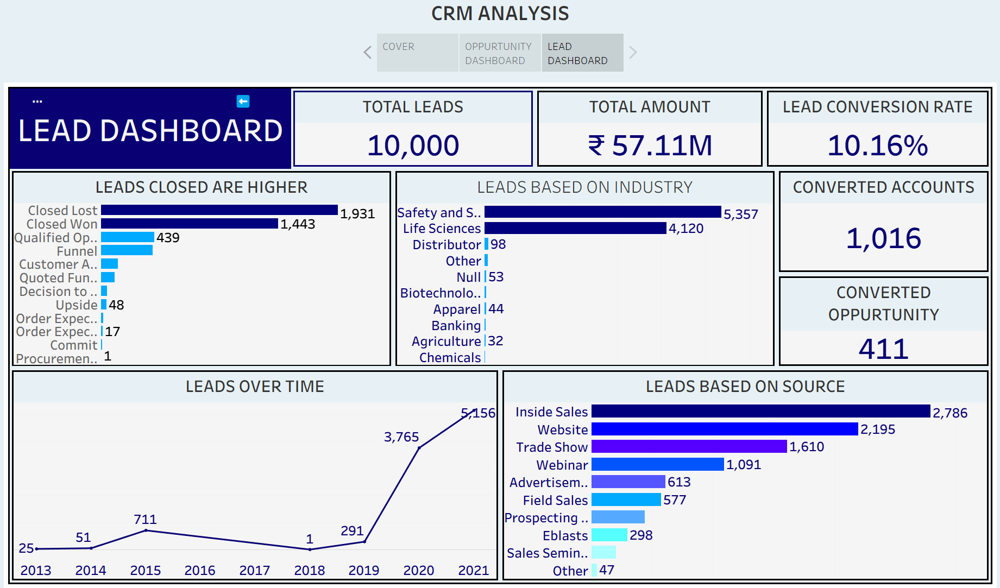

# CRM Sales & Lead Analysis Dashboard (Tableau)

## Project Overview
This project analyzes CRM sales and lead data using **Tableau** to understand sales performance, lead generation trends, opportunity conversion, and revenue potential. The dashboard transforms raw CRM data into interactive visual insights to support better **data-driven business decisions**.

---

## Problem Statement
Sales teams generate large numbers of leads but often struggle to identify which **industries, lead sources, and opportunities contribute most to revenue**. This project analyzes CRM data to uncover patterns that help improve **lead conversion, sales performance, and revenue forecasting**.

---

## Dataset Information
The dataset contains CRM sales data including:

- Lead ID
- Opportunity ID
- Industry
- Lead Source
- Opportunity Stage
- Expected Amount
- Account Conversion Status
- Opportunity Status

The dataset includes **10,000+ lead records and opportunity data** used for sales analysis.

---

## Dashboard Features
The Tableau dashboard provides insights into:

- Lead generation trends
- Opportunity status distribution
- Expected revenue analysis
- Industry-wise opportunity performance
- Lead source performance
- Conversion rate analysis
- Sales win/loss performance

The dashboard allows users to **interactively explore sales data using filters and visual comparisons**.

---

## Key Metrics
- Total Leads: **10,000**
- Total Lead Amount: **₹57.11M**
- Expected Opportunity Revenue: **₹184.14M**
- Active Opportunities: **78**
- Opportunity Conversion Rate: **31.06%**
- Lead Conversion Rate: **10.16%**
- Win Rate: **42.77%**
- Loss Rate: **41.56%**

---

## Key Business Insights
- The **Safety & Security industry generates the highest number of opportunities and expected revenue**.
- **Closed Lost deals are higher than Closed Won deals**, indicating inefficiencies in the sales pipeline.
- **Inside Sales and Website** are the most effective lead generation channels.
- Lead generation increased significantly after **2019**, indicating growth in marketing and sales activities.

---

## Business Recommendations
- Improve **lead qualification and follow-up processes** to increase opportunity conversion.
- Focus marketing efforts on **high-performing industries such as Safety & Security and Life Sciences**.
- Invest more in **digital marketing and inside sales channels**.
- Analyze lost deals to identify **customer objections and improve sales strategies**.

---

## Tools & Technologies
- **Tableau** – Data Visualization and Dashboard Development
- **Microsoft Excel** – Data preparation and cleaning
- Data Analysis
- Business Intelligence Techniques

---

## Skills Demonstrated
- Data Analysis
- Data Visualization
- CRM Data Analysis
- Sales Performance Analysis
- Dashboard Development using Tableau
- Business Insight Generation
- Data Storytelling

---

## Dashboard Preview

### Opportunity Dashboard

### Lead Dashboard

---

## Project Workflow
1. Data Collection  
2. Data Cleaning & Preparation  
3. Data Analysis  
4. Dashboard Development in Tableau  
5. Business Insights & Recommendations  

---

## Future Improvements
- Build predictive models for **lead conversion forecasting**
- Integrate **real-time CRM data**
- Add advanced analytics for **customer segmentation**

---
